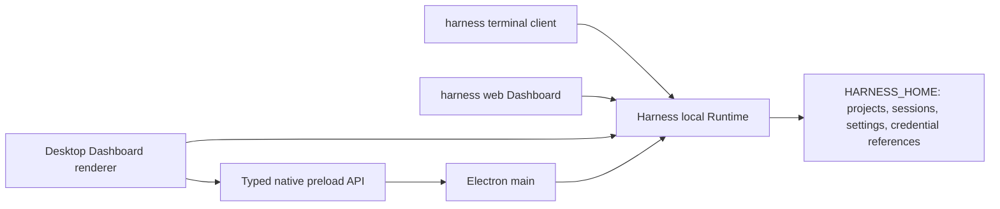

# Harness Desktop Product Architecture Design

English | [中文](2026-08-15-harness-desktop-design.zh.md)

## Status and scope

This document defines the approved product architecture for Harness Desktop, a local-first coding agent product derived from DeepSeek Harness. It covers the outward brand, Electron desktop application, interactive CLI, browser Dashboard, shared local Runtime and data, security model, release channels, and acceptance requirements for Windows, macOS, and Linux.

This is a program-level design divided into five implementation workstreams. Each workstream receives a focused implementation plan and independently reviewable changes. The first implementation plan covers the brand and application foundation; later plans must preserve the interfaces and invariants defined here.

The [Harness unified local Runtime design](2026-08-18-harness-unified-local-runtime-design.md) is authoritative for Runtime ownership, `HARNESS_HOME`, the public `harness` command graph, Dashboard integration, and the three-client topology. This document applies those decisions to the wider Desktop product and release architecture.

The long-lived rationale and rejected topologies are recorded in the [Harness Desktop product topology Agent Note](../../../.agents/notes/proposed/architecture/2026-08-15-harness-desktop-product-topology.md).

## Goals

- Present one outward product named Harness Desktop with the primary `harness` command.
- Ship independently usable native desktop, interactive terminal, and browser Dashboard clients on Windows, macOS, and Linux.
- Connect all three clients to one on-demand local Runtime per `HARNESS_HOME`, with one plugin composition model, session format, settings store, and credential-reference system.
- Preserve source launches, including background Web startup, alongside installed releases.
- Publish signed desktop installers, standalone CLI archives, an npm CLI package, automatic desktop updates, and rollback metadata.
- Let users inspect the same projects and sessions from every client while the Runtime prevents concurrent operations from corrupting a session.

## Non-goals

- The first stable release does not provide cloud synchronization, multi-user collaboration, a mobile client, or a remotely managed agent service.
- The first stable release does not require a repository-wide rename of every internal `@harness-desktop/dsh-*` package.
- The first release matrix does not promise Windows ARM64, Linux ARM64, RPM, Flatpak, or distribution-specific packages beyond the listed targets.
- The renderer never runs agent plugins, reads credentials, or receives unrestricted Node.js access.
- The Runtime never listens on a LAN address or remains as a permanent external service.
- A client never bypasses Runtime ownership or forcefully steals an active session operation.

## System architecture

### Process topology



`apps/desktop` owns the Electron main process, preload script, renderer entry, operating-system integration, packaging, and update client. The renderer hosts the real Harness Dashboard from `@harness-desktop/dsh-client-web` and the existing client UI packages instead of creating a second conversation implementation.

The Electron main process owns windows, the tray, menus, native dialogs, notifications, external-link opening, updates, and Runtime attachment and recovery. It starts the on-demand Runtime only when no healthy instance owns the selected `HARNESS_HOME` and any recorded owner is absent or proved dead; otherwise it authenticates and attaches to the existing instance or fails safely. It retains the endpoint token for native control operations and mints the one-time Dashboard handoff without exposing either secret to the renderer.

The preload script exposes a versioned, typed API containing only Electron-owned desktop operations. The renderer uses the Runtime API as the Dashboard and has no direct access to Electron IPC primitives, arbitrary filesystem paths, environment variables, child-process handles, the Runtime endpoint token, or credential values.

The terminal CLI, browser Dashboard, and Desktop independently attach to one loopback-only Runtime per `HARNESS_HOME`. No frontend composes a private Runtime or reads persistence directly. The CLI launcher, `harness web` launcher, or Electron main starts the Runtime under an atomic per-home lock when needed; every client must complete Runtime health, identity, and protocol-version checks before attaching.

### Component responsibilities

| Component | Responsibility | Direct dependencies |
|---|---|---|
| `apps/desktop` main | Windows, tray, menus, native dialogs, notifications, updates, Runtime attachment and recovery | Electron, Runtime launcher and connection layer |
| `apps/desktop` preload | Narrow typed API for Electron-owned native operations | Electron context bridge, desktop protocol |
| Desktop renderer | Real Dashboard, conversation, approvals, workbench, settings, recovery UI | Existing client Web and UI packages, Runtime API |
| Browser Dashboard | Independently usable Web frontend authenticated by a one-time handoff and cookie | Existing client Web and UI packages, Runtime API |
| Harness local Runtime | Agent composition, tools, persistence, model access, local API, write serialization | Existing Cordis profiles, API and event-stream mechanisms |
| `apps/cli` | Command parsing, interactive terminal UI, non-interactive output, Runtime attachment | Commander, Ink, Runtime connection layer |
| Runtime coordination | Per-home discovery, atomic ownership, process identity, health, background leases, idle shutdown | Endpoint record, process identity probe, persistence |
| Credential providers | Resolve credential references without exposing plaintext to clients | Native OS credential store or environment references |

The desktop protocol and Runtime connection layer use branded identifiers for process, client, and session identities. Runtime defaults are resolved by the owning plugin before execution; clients do not duplicate model, permission, storage, tool, or lifecycle defaults.

## Shared data and session ownership

`HARNESS_HOME` is the sole writable Harness data root. The Runtime owns its settings, credential references, project catalog, session history, event logs, locks, and endpoint records; Desktop, the terminal CLI, and the browser Dashboard use those records only through the authenticated Runtime API. Reads may proceed concurrently, but the Runtime serializes every durable write and allows only one active agent operation to write a given session.

An endpoint record contains the Runtime protocol version, random loopback port, process identifier, process-start identity, and opaque endpoint token. The record is atomically replaced and readable only by the current operating-system user. A client trusts it only after health, identity, and version checks succeed; a stale lock or record is removed only after the recorded process identity is proved dead, so attachment failure never creates duplicate Runtime ownership.

A second client that requests work in an active session receives a typed busy response and may observe the session, open a new session, or wait to resume it. The Runtime emits invalidations so every attached client converges on committed project, session, settings, and credential-reference state without polling or client-specific ownership.

Desktop exposes a copyable `harness resume <session-id>` command. CLI exposes the same session identifier in machine-readable output. Resuming from another client follows Runtime serialization and never creates a hidden duplicate session.

On first start, a detected legacy `DSH_HOME` is only an import source. Import copies supported data into an empty `HARNESS_HOME`, preserves the legacy directory, records the result, and stops on a destination collision; no client writes the legacy root or silently overwrites or deletes its contents.

## Desktop experience

The default desktop layout uses a conversation center with a collapsible engineering workbench. The left sidebar contains workspaces, new-task entry, search, pinned sessions, and history. The center contains the transcript, tool-call cards, plans, approval cards, and composer. The right workbench contains Files, Diff, Terminal, Artifacts, and Tasks tabs. A bottom status bar shows the model, workspace, Git branch, permission mode, Runtime health, and token usage.

Focus mode hides the workbench and emphasizes conversation. Engineering mode opens the workbench and preserves its selected tab and width per workspace. Both modes use one component tree and one navigation model; they are layout states, not separate applications.

Tool calls render as collapsed cards with the operation, state, elapsed time, and result summary. Diff review supports per-file acceptance and restoration. High-risk operations render explicit approval cards. Terminal sessions support tabs and persistence through the Runtime. Artifacts open in the workbench without replacing the conversation.

When the Runtime becomes unavailable, the renderer shows a local recovery page with the categorized attachment failure, retry, and redacted diagnostic export. Electron main proves stale ownership before starting a replacement Runtime and mints a new handoff before reloading the Dashboard. Closing the final window while work is active offers three explicit actions: continue in the tray, stop safely, or cancel closing.

## CLI experience

Running `harness` starts an interactive streaming terminal session in the current directory. The interface preserves normal terminal scrollback and does not use the alternate screen buffer. Ink and React own interactive rendering; Commander continues to own argument parsing.

The supported command set is:

```text
harness
harness "fix the failing tests"
harness run "task" --json
harness web --daemon
harness web --background --no-open
harness web --status
harness web --stop
harness desktop
```

Interactive mode provides `/model`, `/permissions`, `/plan`, `/compact`, `/resume`, `/diff`, `/terminal`, `/doctor`, and `/exit`. Ctrl+C first cancels the active agent operation and a second Ctrl+C forces process exit. Prompts, approvals, tool events, and final output remain visible in terminal history.

`harness run --json` writes protocol JSONL only to stdout. Diagnostics, warnings, progress, and human-readable failures go to stderr. Stable exit codes distinguish success, task failure, configuration failure, permission denial, cancellation, and internal failure.

The terminal client starts or attaches to the Runtime, can list and resume shared sessions, and exits without stopping work used by other clients. Source development exposes `pnpm harness` and accepts the same arguments as the installed binary, including `pnpm harness web --background`. The `dsh` compatibility binary invokes the same command graph, Runtime, and data root.

## Brand and compatibility

The repository and GitHub release project use `Harness-Desktop`; user-facing prose uses Harness Desktop; the primary executable is `harness`; the desktop application identifier is `io.github.naipi11.harness-desktop`; and the public npm package is `@harness-desktop/cli`.

The first stable release keeps `dsh` as a second binary name. The compatibility binary does not maintain a separate parser, Runtime, or data root. `HARNESS_HOME` is the only writable root; legacy `DSH_HOME` data can only be copied through the collision-safe import. Deprecation messaging may begin after the first stable release, and removal requires at least one complete stable release cycle with the warning present.

Internal `@harness-desktop/dsh-*` workspace package names remain private implementation details during the initial product migration. Public CLI artifacts bundle their runtime dependency graph and do not publish new packages under the `@harness-desktop` scope. A later scope migration updates all references atomically and includes an explicit data migration with rollback verification.

## Security and permissions

Electron enables renderer sandboxing and context isolation and disables Node integration. The Content Security Policy rejects inline script execution and unapproved remote origins. External links open through an allowlisted main-process operation.

The Runtime binds an operating-system-selected random port on `127.0.0.1` only and creates no fixed, LAN, or permanent external listener. Its endpoint token is available only to native launchers such as the CLI launcher and Electron main; it never appears in a command line, browser URL, transcript, diagnostic bundle, renderer message, or persisted browser storage.

An authenticated native launcher mints a high-entropy opaque, one-time browser handoff that expires within 60 seconds and remains in Runtime memory until its first successful exchange. The launcher creates a current-user-only bootstrap directory and document, verifies owner-only POSIX modes or the current-user Windows ACL, rejects a broader-access location, and opens a clean file URL whose HTML body has a hidden handoff field. Because a local file has an opaque origin, its top-level form `POST` to `http://127.0.0.1:<port>/_harness/handoff` is intentionally cross-origin: the handler does not require Origin equality, emits no CORS permission, authenticates only the form-body handoff, atomically consumes it once, and sends a clean `303` Dashboard navigation. A launcher-owned helper receives only the bootstrap-document path, schedules exactly one cleanup at `expiresAt`, and deletes the document and its owned directory exactly once after dispatch failure, exchange success or failure, or expiry. Runtime API endpoints and event streams reject Dashboard requests without the session cookie and exact origin, as well as cross-origin credential requests.

The post-exchange randomized or signed session credential appears only in the Runtime `Set-Cookie` response, browser `Cookie` request headers, and the browser's HttpOnly cookie jar; it has `HttpOnly; SameSite=Strict; Path=/`, no expiry attribute, and is never exposed to Dashboard JavaScript, Renderer IPC, browser script storage, app persistence, logs, diagnostics, snapshots, or transcripts. The handoff itself never appears in a URL, hash, query, header, referrer, history, browser storage, Renderer IPC, log, diagnostic, or transcript. Runtime shutdown invalidates every handoff and browser session. A recovered Desktop mints a replacement handoff; an ordinary browser tab shows a copyable `harness web` reconnection command.

Credential providers store references in Harness data and secrets in Windows Credential Manager, macOS Keychain, or Linux Secret Service. Headless Linux and automation may use environment or `.env` references. A missing native credential store fails with guidance; the application does not create a custom plaintext or home-grown encrypted vault.

The renderer receives credential metadata and opaque reference identifiers, never secret values. Logs, sessions, crash reports, and `harness doctor --bundle` redact registered credential values, authorization headers, sensitive environment variables, and update tokens.

Filesystem, shell, network, and external-application permissions remain separate. Grants may apply once, to the current session, or to the current workspace. Writes outside the workspace, privilege elevation, destructive filesystem operations, and external publication always require explicit approval.

Telemetry and crash upload are disabled by default. Diagnostic bundles are generated locally and are never uploaded without a separate user action.

## Lifecycle and failure handling

Every client waits for the Runtime health, process-identity, and protocol-version handshake before exposing an operational connection. A mismatch or unreachable recorded owner fails safely with a typed recovery result. No client starts a second Runtime or removes its lock until the recorded process identity is proved dead; replacement startup uses bounded backoff and stops after repeated early crashes.

The Runtime stays alive while it has an attached client, active agent work, or explicit background lease. `--daemon` and `--background` create the same in-process lease. `harness web --status` reports redacted health and lease state without starting a Runtime; `harness web --stop` releases only the background lease and never cancels agent work or disconnects another client.

When no client, active work, or background lease remains, the Runtime begins its configurable idle period. It then stops accepting new work, cancels or settles active operations according to the user's choice, flushes persistence, removes its endpoint record, releases its lock, and exits. A background lease never causes automatic restart after a crash, sign-out, or application upgrade, and closing one frontend never stops work still used by another.

Failures cross client boundaries as typed categories with a safe user message, stable code, optional corrective action, and redacted diagnostic detail. Desktop presents recovery actions; interactive CLI prints a concise error and keeps the session usable where possible; JSON mode emits a terminal error event and a non-zero exit code.

Desktop update installation retains the current version until the replacement passes launch health checks. A failed launch offers rollback and records the failed version locally. CLI self-update applies only to standalone archives; npm installations print the package-manager command and never modify package-manager-owned files.

## Distribution and updates

| Platform | Desktop artifact | CLI artifact |
|---|---|---|
| Windows 10/11 x64 | Authenticode-signed `.exe` installer | npm package and ZIP archive |
| macOS 13+ Intel and Apple Silicon | Developer ID-signed and notarized universal `.dmg` | npm package and architecture-specific archives |
| Linux x64 | AppImage and `.deb` | npm package and tar archive |

Electron Builder produces desktop artifacts. Standalone CLI archives include the tested Node.js runtime, application bundle, and matching native modules rather than relying on a system Node installation. GitHub Actions builds and smoke-tests artifacts on native Windows, macOS, and Linux runners.

GitHub Releases publishes `stable`, `beta`, and `nightly` channels. Every release contains a signed update manifest, SHA-256 checksums, platform artifacts, and release notes. Desktop accepts only a manifest whose signature, channel, application identifier, platform, architecture, and artifact digest all match the request.

The `stable` channel cannot publish unless native install, first launch, task execution, session resume, update, and rollback smoke tests pass on every supported desktop platform. An unavailable signing identity blocks the stable artifact instead of producing an unsigned substitute.

## Delivery workstreams

1. **Brand and Runtime foundation:** establish centralized product metadata, `harness` and `dsh` entries, `HARNESS_HOME` resolution and import, Runtime discovery, locking and local authentication, build faces, source launches, and release scaffolding.
2. **Desktop minimum loop:** deliver Runtime discovery and attachment, the secured real Dashboard, conversation streaming, approval, recovery, and the focus layout.
3. **Desktop engineering workbench:** deliver Files, Diff, Terminal, Artifacts, Tasks, the engineering layout, and shared-session observation and resume.
4. **CLI and Web productization:** deliver the Ink interaction loop, slash commands, JSON mode, browser Dashboard handoff, background-lease status and stop, resume flow, diagnostics, and updater behavior.
5. **Release completion:** deliver native packaging, signing, notarization, channel manifests, automatic updates, rollback, and the full platform smoke matrix.

Each workstream must leave the repository runnable from source and produce an independently reviewable change. A later workstream may extend an earlier interface but may not create a second Runtime owner, persistence writer, session format, settings store, credential store, or permission model.

## Verification and acceptance

Unit tests cover command parsing, desktop protocol validation, permission decisions, Runtime discovery and identity checks, background leases, update manifests, and redaction. Package integration tests cover Runtime ready, attachment, crash recovery, idle and graceful shutdown, endpoint cleanup, and credential-provider failure.

Keyless snapshots cover every new model-visible or product-user-visible transcript through a real runnable composition. Electron end-to-end tests use Playwright against the packaged renderer and real Runtime API. CLI end-to-end tests use a real pseudo-terminal to verify input editing, scrollback, streaming, Ctrl+C, terminal resize, color fallback, and exit codes.

Cross-client tests create a project and session from each of the terminal CLI, browser Dashboard, and Desktop, observe the same durable state from the other two, reject concurrent session operations, and recover stale Runtime records only after the recorded process identity is dead. Lifecycle tests prove `harness web --status` never starts a Runtime, `harness web --stop` releases only the background lease, and one client closing does not stop another client's work. Security tests prove owner-only bootstrap modes or ACLs and reject broader locations, verify never-dispatched cleanup at `expiresAt` plus dispatch/exchange failure cleanup, prove an opaque file origin reaches the body-only exchange, reject wrong, reused, and expired handoffs, confirm its no-CORS clean `303`, enforce the cookie-only exact-origin Dashboard API and event authentication, and cover loopback-only binding, endpoint-token non-disclosure, renderer privilege denial, credential redaction, malicious update manifests, and workspace escape requests.

The first usable release is accepted when a user can install the CLI and Desktop, run the terminal CLI, browser Dashboard, and Desktop independently, open the same local project, exchange work through one shared session history, approve tools, inspect modifications, and close any one client without losing another client's active work on every supported platform. Background Web acceptance also requires observable lease status and a stop operation that leaves active work and attached clients intact. The first stable release additionally requires signed artifacts, verified automatic update, verified rollback, no known secret leakage, and green platform smoke tests.
