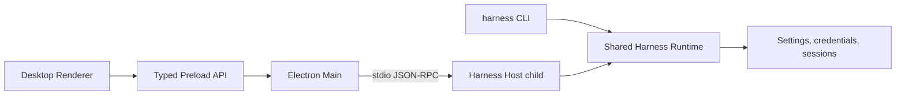

# Harness Desktop Product Architecture Design

English | [中文](2026-08-15-harness-desktop-design.zh.md)

## Status and scope

This document defines the approved product architecture for Harness Desktop, a local-first coding agent product derived from DeepSeek Harness. It covers the outward brand, Electron desktop application, interactive CLI, shared local data, security model, release channels, and acceptance requirements for Windows, macOS, and Linux.

This is a program-level design divided into five implementation workstreams. Each workstream receives a focused implementation plan and independently reviewable changes. The first implementation plan covers the brand and application foundation; later plans must preserve the interfaces and invariants defined here.

The long-lived rationale and rejected topologies are recorded in the [Harness Desktop product topology Agent Note](../../../.agents/notes/proposed/architecture/2026-08-15-harness-desktop-product-topology.md).

## Goals

- Present one outward product named Harness Desktop with the primary `harness` command.
- Ship a native-feeling desktop client and an interactive terminal client on Windows, macOS, and Linux.
- Reuse one Harness runtime, plugin composition model, session format, settings store, and credential-reference system across both clients.
- Preserve source launches, including background Web startup, alongside installed releases.
- Publish signed desktop installers, standalone CLI archives, an npm CLI package, automatic desktop updates, and rollback metadata.
- Let users inspect the same sessions from either client while preventing concurrent writers from corrupting a session.

## Non-goals

- The first stable release does not provide cloud synchronization, multi-user collaboration, a mobile client, or a remotely managed agent service.
- The first stable release does not require a repository-wide rename of every internal `@harness-desktop/dsh-*` package.
- The first release matrix does not promise Windows ARM64, Linux ARM64, RPM, Flatpak, or distribution-specific packages beyond the listed targets.
- The renderer never runs agent plugins, reads credentials, or receives unrestricted Node.js access.
- A client never forcefully steals a live session writer lease.

## System architecture

### Process topology



`apps/desktop` owns the Electron main process, preload script, renderer entry, operating-system integration, packaging, and update client. The renderer reuses `@harness-desktop/dsh-client-web` and the existing client UI packages instead of creating a second conversation implementation.

The Electron main process starts one Harness Host child for each desktop application instance. The child is a complete Cordis application assembled from existing plugins. The main process communicates with it over the repository's newline-delimited stdio JSON-RPC transport, keeps stdout protocol-pure, routes diagnostics through stderr, and restarts the child only after the previous process and streams have settled.

The preload script exposes a versioned, typed API containing only desktop operations. It translates renderer requests to Host protocol calls and Electron-owned operating-system actions. The renderer has no direct access to Electron IPC primitives, arbitrary filesystem paths, environment variables, or child-process handles.

The CLI composes the same runtime packages in its own Node.js process. It does not require the desktop application or a permanent local service. A future shared broker may replace the two ownership modes without changing session identities or client-visible commands, but it is not part of the first stable release.

### Component responsibilities

| Component | Responsibility | Direct dependencies |
|---|---|---|
| `apps/desktop` main | Window, tray, menus, Host supervision, native dialogs, updates | Electron, Host launcher, desktop protocol |
| `apps/desktop` preload | Narrow typed renderer API and event subscription | Electron context bridge, desktop protocol |
| Desktop renderer | Conversation, approvals, workbench, settings, recovery UI | Existing client Web and UI packages |
| Harness Host child | Agent runtime, tools, terminal, persistence, model access | Existing Cordis profiles and stdio JSON-RPC server |
| `apps/cli` | Command parsing, interactive terminal UI, non-interactive output | Commander, Ink, shared runtime packages |
| Session lease service | Single-writer acquisition, release, takeover request, stale-owner recovery | SQLite persistence and process identity probe |
| Credential providers | Resolve credential references without exposing plaintext to clients | Native OS credential store or environment references |

The desktop protocol and session lease service use branded identifiers for process, client, and lease identities. Runtime defaults are resolved by the owning plugin before execution; the clients do not duplicate model, permission, storage, or tool defaults.

## Shared data and session ownership

Desktop and CLI use the same settings, credential references, workspace catalog, session history, and event log under the existing Harness home layout during the compatibility phase. Both clients may read a session concurrently, but only one process may append model-visible or lifecycle events.

The session lease service stores an owner token, process identifier, process start identity, client kind, heartbeat deadline, and takeover request in SQLite. Acquisition and release use transactions. A client that cannot acquire the lease opens the session read-only and shows the live owner.

A takeover request asks the live owner to finish its current durable step, stop issuing new model or tool work, flush the event log, and release the lease. The requesting client acquires the lease only after observing the committed release. If the owner stops responding, recovery requires proof that the recorded process identity is no longer alive; expiry alone never permits a second writer.

Desktop exposes a copyable `harness resume <session-id>` command. CLI exposes the same session identifier in machine-readable output. Resuming from another client follows the lease rules and never creates a hidden duplicate session.

## Desktop experience

The default desktop layout uses a conversation center with a collapsible engineering workbench. The left sidebar contains workspaces, new-task entry, search, pinned sessions, and history. The center contains the transcript, tool-call cards, plans, approval cards, and composer. The right workbench contains Files, Diff, Terminal, Artifacts, and Tasks tabs. A bottom status bar shows the model, workspace, Git branch, permission mode, Host health, and token usage.

Focus mode hides the workbench and emphasizes conversation. Engineering mode opens the workbench and preserves its selected tab and width per workspace. Both modes use one component tree and one navigation model; they are layout states, not separate applications.

Tool calls render as collapsed cards with the operation, state, elapsed time, and result summary. Diff review supports per-file acceptance and restoration. High-risk operations render explicit approval cards. Terminal sessions support tabs and persistence through the Host. Artifacts open in the workbench without replacing the conversation.

When the Host exits unexpectedly, the renderer remains available, displays the categorized failure, and offers restart or diagnostic export. Closing the final window while work is active offers three explicit actions: continue in the tray, stop safely, or cancel closing.

## CLI experience

Running `harness` starts an interactive streaming terminal session in the current directory. The interface preserves normal terminal scrollback and does not use the alternate screen buffer. Ink and React own interactive rendering; Commander continues to own argument parsing.

The supported command set is:

```text
harness
harness "fix the failing tests"
harness run "task"
harness run "task" --json
harness resume [session]
harness web --background
harness desktop
harness serve
harness auth
harness config
harness models
harness doctor
harness update
```

Interactive mode provides `/model`, `/permissions`, `/plan`, `/compact`, `/resume`, `/diff`, `/terminal`, `/doctor`, and `/exit`. Ctrl+C first cancels the active agent operation and a second Ctrl+C forces process exit. Prompts, approvals, tool events, and final output remain visible in terminal history.

`harness run --json` writes protocol JSONL only to stdout. Diagnostics, warnings, progress, and human-readable failures go to stderr. Stable exit codes distinguish success, task failure, configuration failure, permission denial, cancellation, and internal failure.

Source development exposes `pnpm harness` and accepts the same arguments as the installed binary, including `pnpm harness web --background`. The `dsh` compatibility binary invokes the same command graph and data layout.

## Brand and compatibility

The repository and GitHub release project use `Harness-Desktop`; user-facing prose uses Harness Desktop; the primary executable is `harness`; the desktop application identifier is `io.github.naipi11.harness-desktop`; and the public npm package is `@harness-desktop/cli`.

The first stable release keeps `dsh` as a second binary name and retains the existing Harness home layout. The compatibility binary does not maintain a separate parser or runtime. Deprecation messaging may begin after the first stable release, and removal requires at least one complete stable release cycle with the warning present.

Internal `@harness-desktop/dsh-*` workspace package names remain private implementation details during the initial product migration. Public CLI artifacts bundle their runtime dependency graph and do not publish new packages under the `@harness-desktop` scope. A later scope migration updates all references atomically and includes an explicit data migration with rollback verification.

## Security and permissions

Electron enables renderer sandboxing and context isolation and disables Node integration. The Content Security Policy rejects inline script execution and unapproved remote origins. External links open through an allowlisted main-process operation.

The Host transport uses owned stdio streams and exposes no fixed TCP listener. Protocol inputs are validated at the process boundary. The main process treats an unexpected frame, stdout contamination, protocol-version mismatch, or child identity mismatch as a Host failure and closes the channel.

Credential providers store references in Harness data and secrets in Windows Credential Manager, macOS Keychain, or Linux Secret Service. Headless Linux and automation may use environment or `.env` references. A missing native credential store fails with guidance; the application does not create a custom plaintext or home-grown encrypted vault.

The renderer receives credential metadata and opaque reference identifiers, never secret values. Logs, sessions, crash reports, and `harness doctor --bundle` redact registered credential values, authorization headers, sensitive environment variables, and update tokens.

Filesystem, shell, network, and external-application permissions remain separate. Grants may apply once, to the current session, or to the current workspace. Writes outside the workspace, privilege elevation, destructive filesystem operations, and external publication always require explicit approval.

Telemetry and crash upload are disabled by default. Diagnostic bundles are generated locally and are never uploaded without a separate user action.

## Lifecycle and failure handling

The desktop main process waits for a versioned ready handshake before exposing an operational Host. Heartbeats distinguish a busy Host from an exited or unreachable Host. Restart uses bounded backoff and stops after repeated early crashes so a configuration error cannot create an infinite restart loop.

The Host flushes durable session events before reporting a completed step. On shutdown it stops accepting new work, cancels or settles active operations according to the user's choice, flushes persistence, closes protocol output, and then exits. The supervisor never reports success until process exit and stream settlement agree.

Failures cross client boundaries as typed categories with a safe user message, stable code, optional corrective action, and redacted diagnostic detail. Desktop presents recovery actions; interactive CLI prints a concise error and keeps the session usable where possible; JSON mode emits a terminal error event and a non-zero exit code.

Desktop update installation retains the current version until the replacement passes launch health checks. A failed launch offers rollback and records the failed version locally. CLI self-update applies only to standalone archives; npm installations print the package-manager command and never modify package-manager-owned files.

## Distribution and updates

| Platform | Desktop artifact | CLI artifact |
|---|---|---|
| Windows 10/11 x64 | Authenticode-signed `.exe` installer | npm package and ZIP archive |
| macOS 13+ Intel and Apple Silicon | Developer ID-signed and notarized universal `.dmg` | npm package and architecture-specific archives |
| Linux x64 | AppImage and `.deb` | npm package and tar archive |

Electron Builder produces desktop artifacts. Standalone CLI archives include the tested Node.js runtime, application bundle, and matching native modules rather than relying on a system Node installation. GitHub Actions builds and smoke-tests artifacts on native Windows, macOS, and Linux runners.

GitHub Releases publishes `stable`, `beta`, and `nightly` channels. Every release contains a signed update manifest, SHA-256 checksums, platform artifacts, and release notes. Desktop accepts only a manifest whose signature, channel, application identifier, platform, architecture, and artifact digest all match the request.

The `stable` channel cannot publish unless native install, first launch, task execution, session resume, update, and rollback smoke tests pass on every supported desktop platform. An unavailable signing identity blocks the stable artifact instead of producing an unsigned substitute.

## Delivery workstreams

1. **Brand and application foundation:** establish centralized product metadata, `harness` and `dsh` entries, `apps/desktop`, build faces, source launches, and release scaffolding.
2. **Desktop minimum loop:** deliver workspace selection, Host supervision, conversation streaming, approval, persistence, recovery, and the focus layout.
3. **Desktop engineering workbench:** deliver Files, Diff, Terminal, Artifacts, Tasks, engineering layout, session leases, and cross-client takeover.
4. **CLI productization:** deliver the Ink interaction loop, slash commands, JSON mode, exit-code contract, resume flow, diagnostics, and updater behavior.
5. **Release completion:** deliver native packaging, signing, notarization, channel manifests, automatic updates, rollback, and the full platform smoke matrix.

Each workstream must leave the repository runnable from source and produce an independently reviewable change. A later workstream may extend an earlier interface but may not create a second runtime, session format, settings store, or permission model.

## Verification and acceptance

Unit tests cover command parsing, desktop protocol validation, permission decisions, session lease transactions, takeover ordering, update manifests, and redaction. Package integration tests cover Host ready, crash, restart, graceful shutdown, stream settlement, and credential-provider failure.

Keyless snapshots cover every new model-visible or product-user-visible transcript through a real runnable composition. Electron end-to-end tests use Playwright against the packaged renderer and real Host protocol. CLI end-to-end tests use a real pseudo-terminal to verify input editing, scrollback, streaming, Ctrl+C, terminal resize, color fallback, and exit codes.

Cross-client tests open one persisted session from Desktop and CLI, prove concurrent read access, reject a second writer, complete a cooperative takeover, and recover a stale lease only after the recorded process identity is dead. Security tests exercise renderer privilege denial, malformed protocol frames, stdout contamination, credential redaction, malicious update manifests, and workspace escape requests.

The first usable release is accepted when a user can install either client, open a local project, start an agent task, approve tools, inspect modifications, resume the durable session, and transfer write ownership between Desktop and CLI on every supported platform. The first stable release additionally requires signed artifacts, verified automatic update, verified rollback, no known secret leakage, and green platform smoke tests.
