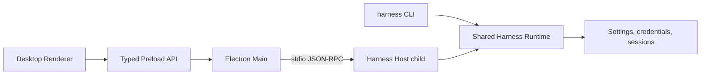

# Harness Desktop 产品架构设计

[English](2026-08-15-harness-desktop-design.md) | 中文

## 状态与范围

本文定义 Harness Desktop 已确认的产品架构。Harness Desktop 是从 DeepSeek Harness 演化而来的本地优先 coding agent（编程智能体）产品。本文覆盖对外品牌、Electron 桌面应用、交互式 CLI（命令行界面）、共享本地数据、Windows、macOS 与 Linux 的安全模型、发布频道及验收要求。

这是一个项目群级设计，拆分为五个实施工作流。每个工作流都要有聚焦的实施计划和可独立评审的改动。第一个实施计划覆盖品牌与应用基础；后续计划必须保持本文定义的接口与不变式。

长期有效的理由与未采用的拓扑记录在 [Harness Desktop 产品拓扑 Agent Note](../../../.agents/notes/proposed/architecture/2026-08-15-harness-desktop-product-topology.md) 中。

## 目标

- 以 Harness Desktop 作为统一对外产品名称，并以 `harness` 作为主命令。
- 在 Windows、macOS 与 Linux 上交付具有原生体验的桌面客户端和交互式终端客户端。
- 两种客户端复用同一套 Harness 运行时、插件组合模型、会话格式、设置存储与凭据引用系统。
- 在安装版之外保留源码启动方式，包括后台启动 Web。
- 发布已签名的桌面安装器、独立 CLI 压缩包、npm CLI 包、桌面自动更新和回滚元数据。
- 用户可以从任一客户端查看相同会话，同时防止并发写入者破坏会话。

## 非目标

- 第一个稳定版本不提供云同步、多人协作、移动客户端或远程托管的 agent 服务。
- 第一个稳定版本不要求一次性重命名仓库内全部 `@deepseek-ai/dsh-*` 包。
- 第一版支持矩阵不承诺 Windows ARM64、Linux ARM64、RPM、Flatpak 或已列目标之外的发行版专用软件包。
- Renderer 不运行 agent 插件、不读取凭据，也不获得不受限制的 Node.js 访问权限。
- 客户端绝不强行抢占仍然存活的会话写入租约。

## 系统架构

### 进程拓扑



`apps/desktop` 负责 Electron 主进程、preload 脚本、Renderer 入口、操作系统集成、打包和更新客户端。Renderer 复用 `@deepseek-ai/dsh-client-web` 与现有客户端 UI 包，不另建第二套对话实现。

Electron 主进程为每个桌面应用实例启动一个 Harness Host 子进程。该子进程是由现有插件组成的完整 Cordis 应用。主进程通过仓库现有的换行分隔 stdio JSON-RPC 协议与它通信，保持 stdout 只承载协议，通过 stderr 传递诊断，并且仅在前一进程退出且数据流完全结束后重启子进程。

preload 脚本只暴露带版本、强类型的桌面 API。它把 Renderer 请求转换为 Host 协议调用和 Electron 所有的操作系统动作。Renderer 不能直接访问 Electron IPC 原语、任意文件系统路径、环境变量或子进程句柄。

CLI 在自身 Node.js 进程中组合相同的运行时包。它不依赖桌面应用或永久本地服务。未来的共享 broker 可以替换这两种所有权模式，而不改变会话标识或客户端可见命令，但它不属于第一个稳定版本。

### 组件职责

| 组件 | 职责 | 直接依赖 |
|---|---|---|
| `apps/desktop` 主进程 | 窗口、托盘、菜单、Host 监管、原生对话框、更新 | Electron、Host 启动器、桌面协议 |
| `apps/desktop` preload | 收窄的强类型 Renderer API 与事件订阅 | Electron context bridge、桌面协议 |
| Desktop Renderer | 对话、审批、工作台、设置、恢复界面 | 现有客户端 Web 与 UI 包 |
| Harness Host 子进程 | agent 运行时、工具、终端、持久化、模型访问 | 现有 Cordis profile 与 stdio JSON-RPC 服务端 |
| `apps/cli` | 命令解析、交互式终端 UI、非交互输出 | Commander、Ink、共享运行时包 |
| 会话租约服务 | 单写入者获取、释放、接管请求、失效所有者恢复 | SQLite 持久化与进程身份探测 |
| 凭据提供方 | 在不向客户端暴露明文的前提下解析凭据引用 | 操作系统原生凭据存储或环境变量引用 |

桌面协议和会话租约服务使用品牌化标识符表示进程、客户端与租约身份。运行时默认值由所属插件在执行前解析；客户端不复制模型、权限、存储或工具默认值。

## 共享数据与会话所有权

在兼容阶段，Desktop 和 CLI 使用现有 Harness 主目录布局中的同一套设置、凭据引用、工作区目录、会话历史与事件日志。两种客户端可以并发读取一个会话，但只有一个进程可以追加模型可见事件或生命周期事件。

会话租约服务在 SQLite 中保存所有者 token、进程标识符、进程启动身份、客户端类型、心跳期限和接管请求。获取和释放操作使用事务。无法取得租约的客户端以只读方式打开会话，并显示当前所有者。

接管请求要求存活的所有者完成当前持久化步骤、停止发起新的模型或工具工作、刷新事件日志并释放租约。请求方只在观察到已提交的释放后取得租约。如果所有者停止响应，恢复操作必须证明记录的进程身份已经不再存活；仅凭过期时间绝不允许第二个写入者进入。

Desktop 提供可复制的 `harness resume <session-id>` 命令。CLI 在机器可读输出中暴露相同的会话标识符。从另一客户端恢复会话时必须遵守租约规则，绝不暗中创建重复会话。

## Desktop 体验

默认桌面布局由中央对话区和可折叠工程工作台组成。左侧栏包含工作区、新建任务入口、搜索、固定会话和历史记录。中央区包含 transcript（文本记录）、工具调用卡片、计划、审批卡片和输入框。右侧工作台包含 Files、Diff、Terminal、Artifacts 和 Tasks 标签页。底部状态栏显示模型、工作区、Git 分支、权限模式、Host 健康状态与 token 用量。

专注模式隐藏工作台并突出对话。工程模式展开工作台，并按工作区保存所选标签页和宽度。两种模式使用同一组件树和导航模型；它们是布局状态，不是两套独立应用。

工具调用默认渲染为收起的卡片，显示操作、状态、耗时和结果摘要。Diff 审阅支持按文件接受和恢复。高风险操作显示明确的审批卡片。终端会话通过 Host 支持多标签和持久化。Artifacts 在工作台中打开，不替换对话。

Host 意外退出时，Renderer 保持可用，显示已分类的失败并提供重启或导出诊断。仍有工作运行时关闭最后一个窗口，应用明确提供三种选择：在托盘中继续、安全停止或取消关闭。

## CLI 体验

运行 `harness` 会在当前目录启动交互式流式终端会话。界面保留普通终端滚动历史，不使用备用屏幕缓冲区。Ink 与 React 负责交互渲染；Commander 继续负责参数解析。

支持的命令集合为：

```text
harness
harness "fix the failing tests"
harness run "task"
harness run "task" --json
harness resume [session]
harness web --background
harness desktop
harness serve
harness auth
harness config
harness models
harness doctor
harness update
```

交互模式提供 `/model`、`/permissions`、`/plan`、`/compact`、`/resume`、`/diff`、`/terminal`、`/doctor` 和 `/exit`。Ctrl+C 第一次取消当前 agent 操作，第二次强制退出进程。提示词、审批、工具事件和最终输出都保留在终端历史中。

`harness run --json` 只向 stdout 写入协议 JSONL。诊断、警告、进度和人类可读错误写入 stderr。稳定退出码区分成功、任务失败、配置失败、权限拒绝、取消和内部失败。

源码开发提供 `pnpm harness`，并接受与安装版二进制相同的参数，包括 `pnpm harness web --background`。兼容的 `dsh` 二进制调用相同命令图和数据布局。

## 品牌与兼容性

仓库与 GitHub 发布项目使用 `Harness-Desktop`；面向用户的正文使用 Harness Desktop；主可执行文件为 `harness`；桌面应用标识符为 `io.github.naipi11.harness-desktop`；公开 npm 包为 `@harness-desktop/cli`。

第一个稳定版本把 `dsh` 保留为第二个二进制名称，并保留现有 Harness 主目录布局。兼容二进制不维护独立解析器或运行时。第一个稳定版本发布后可以开始显示弃用提示；只有在该提示完整存在至少一个稳定版本周期后才可移除。

产品迁移初期，内部 `@deepseek-ai/dsh-*` 工作区包名继续作为私有实现细节。公开 CLI 产物打包自身的运行时依赖图，不在 `@deepseek-ai` scope 下发布新包。后续 scope 迁移必须原子更新全部引用，并包含具有回滚验证的明确数据迁移。

## 安全与权限

Electron 启用 Renderer 沙箱和 context isolation，并禁用 Node 集成。Content Security Policy 拒绝内联脚本执行和未经批准的远程源。外部链接只能通过主进程白名单操作打开。

Host 传输使用自身持有的 stdio 数据流，不暴露固定 TCP 监听器。协议输入在进程边界校验。主进程把意外帧、stdout 污染、协议版本不匹配或子进程身份不匹配视为 Host 故障并关闭通道。

凭据提供方把引用存入 Harness 数据，把密钥存入 Windows Credential Manager、macOS Keychain 或 Linux Secret Service。无界面 Linux 环境和自动化可以使用环境变量或 `.env` 引用。缺少原生凭据存储时，应用应给出修正指引并失败；应用不创建自定义明文或自行设计的加密保险库。

Renderer 只接收凭据元数据和不透明引用标识符，绝不接收密钥值。日志、会话、崩溃报告与 `harness doctor --bundle` 会清理已注册凭据值、授权头、敏感环境变量和更新 token。

文件系统、Shell、网络与外部应用权限彼此独立。授权可以仅应用一次、应用于当前会话或当前工作区。工作区外写入、提权、破坏性文件系统操作与外部发布始终需要明确审批。

遥测和崩溃上传默认关闭。诊断包只在本地生成，未经单独的用户操作绝不上传。

## 生命周期与失败处理

桌面主进程等待带版本的 ready 握手完成后，才把 Host 标记为可用。心跳用于区分繁忙的 Host 与已退出或不可达的 Host。重启使用有界退避，并在连续早期崩溃后停止，使配置错误无法形成无限重启循环。

Host 在报告持久化步骤完成之前刷新会话事件。关闭时，它停止接受新工作，按用户选择取消或结算活动操作，刷新持久化，关闭协议输出，随后退出。只有进程退出状态与数据流结束状态一致，监管器才报告成功。

跨客户端传递的失败包含强类型分类、安全的用户消息、稳定代码、可选修正动作和已脱敏诊断详情。Desktop 显示恢复操作；交互式 CLI 输出简洁错误，并在可能时保持会话可用；JSON 模式输出终止错误事件和非零退出码。

Desktop 安装更新时保留当前版本，直至替代版本通过启动健康检查。启动失败会提供回滚，并在本地记录失败版本。CLI 自更新只适用于独立压缩包；npm 安装只显示包管理器命令，绝不修改包管理器所有的文件。

## 分发与更新

| 平台 | Desktop 产物 | CLI 产物 |
|---|---|---|
| Windows 10/11 x64 | Authenticode 签名的 `.exe` 安装器 | npm 包与 ZIP 压缩包 |
| macOS 13+ Intel 与 Apple Silicon | Developer ID 签名并公证的通用 `.dmg` | npm 包与各架构独立压缩包 |
| Linux x64 | AppImage 与 `.deb` | npm 包与 tar 压缩包 |

Electron Builder 生成桌面产物。独立 CLI 压缩包包含已测试的 Node.js 运行时、应用包和匹配的原生模块，不依赖系统 Node 安装。GitHub Actions 在原生 Windows、macOS 与 Linux runner 上构建并冒烟测试产物。

GitHub Releases 发布 `stable`、`beta` 和 `nightly` 频道。每个版本都包含已签名更新 manifest（元数据清单）、SHA-256 校验、平台产物与发布说明。Desktop 只接受签名、频道、应用标识符、平台、架构和产物摘要全部与请求匹配的 manifest。

只有每个受支持桌面平台都通过原生安装、首次启动、任务执行、会话恢复、更新和回滚冒烟测试后，才可发布 `stable` 频道。签名身份不可用时应阻止稳定版产物发布，而不是生成无签名替代品。

## 实施工作流

1. **品牌与应用基础：** 建立集中式产品元数据、`harness` 与 `dsh` 入口、`apps/desktop`、构建面、源码启动和发布脚手架。
2. **Desktop 最小闭环：** 交付工作区选择、Host 监管、对话流、审批、持久化、恢复和专注布局。
3. **Desktop 工程工作台：** 交付 Files、Diff、Terminal、Artifacts、Tasks、工程布局、会话租约和跨客户端接管。
4. **CLI 产品化：** 交付 Ink 交互循环、斜杠命令、JSON 模式、退出码约定、恢复流程、诊断和更新器行为。
5. **完整发布：** 交付原生打包、签名、公证、频道 manifest、自动更新、回滚和完整平台冒烟测试矩阵。

每个工作流都必须保持仓库可从源码运行，并产生可独立评审的改动。后续工作流可以扩展早期接口，但不得建立第二套运行时、会话格式、设置存储或权限模型。

## 验证与验收

单元测试覆盖命令解析、桌面协议校验、权限决策、会话租约事务、接管顺序、更新 manifest 和脱敏。包集成测试覆盖 Host ready、崩溃、重启、优雅关闭、数据流结束和凭据提供方失败。

每项新增模型可见或产品用户可见的 transcript 都通过真实可运行组合加入无密钥快照。Electron 端到端测试使用 Playwright 驱动已打包的 Renderer 和真实 Host 协议。CLI 端到端测试使用真实伪终端验证输入编辑、滚动历史、流式输出、Ctrl+C、终端尺寸变化、颜色降级与退出码。

跨客户端测试从 Desktop 和 CLI 打开同一持久化会话，证明并发读取可用、第二个写入者被拒绝、协作接管能够完成，并且只在记录的进程身份死亡后恢复失效租约。安全测试覆盖 Renderer 越权拒绝、畸形协议帧、stdout 污染、凭据脱敏、恶意更新 manifest 与工作区逃逸请求。

当用户可以在每个受支持平台安装任一客户端、打开本地项目、启动 agent 任务、审批工具、查看修改、恢复持久会话，并在 Desktop 与 CLI 之间转移写入所有权时，首个可用版本通过验收。第一个稳定版本还要求产物已签名、自动更新和回滚已经验证、没有已知密钥泄露，且平台冒烟测试全部通过。
