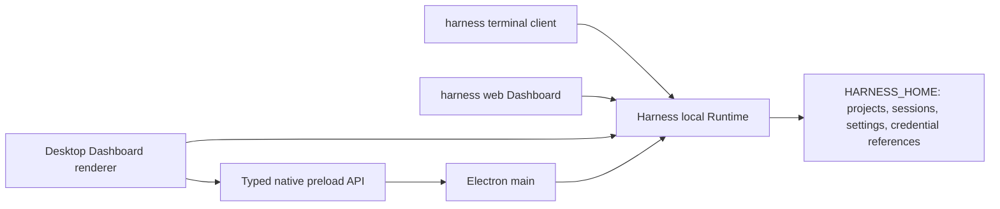

# Harness Desktop 产品架构设计

[English](2026-08-15-harness-desktop-design.md) | 中文

## 状态与范围

本文定义 Harness Desktop 已确认的产品架构。Harness Desktop 是从 DeepSeek Harness 演化而来的本地优先 coding agent（编程智能体）产品。本文覆盖对外品牌、Electron 桌面应用、交互式 CLI（命令行界面）、浏览器 Dashboard（仪表盘）、共享本地 Runtime 与数据、Windows、macOS 与 Linux 的安全模型、发布频道及验收要求。

这是一个项目群级设计，拆分为五个实施工作流。每个工作流都要有聚焦的实施计划和可独立评审的改动。第一个实施计划覆盖品牌与应用基础；后续计划必须保持本文定义的接口与不变式。

[Harness 统一本地 Runtime 设计](2026-08-18-harness-unified-local-runtime-design.md) 是 Runtime 所有权、`HARNESS_HOME`、公开的 `harness` 命令图、Dashboard 集成和三客户端拓扑的权威定义。本文把这些决定应用于更广泛的 Desktop 产品与发布架构。

长期有效的理由与未采用的拓扑记录在 [Harness Desktop 产品拓扑 Agent Note](../../../.agents/notes/proposed/architecture/2026-08-15-harness-desktop-product-topology.md) 中。

## 目标

- 以 Harness Desktop 作为统一对外产品名称，并以 `harness` 作为主命令。
- 在 Windows、macOS 与 Linux 上交付可独立使用的原生桌面客户端、交互式终端客户端和浏览器 Dashboard。
- 三个客户端都连接到每个 `HARNESS_HOME` 一个的按需本地 Runtime，共用一套插件组合模型、会话格式、设置存储与凭据引用系统。
- 在安装版之外保留源码启动方式，包括后台启动 Web。
- 发布已签名的桌面安装器、独立 CLI 压缩包、npm CLI 包、桌面自动更新和回滚元数据。
- 用户可以从每个客户端查看相同项目与会话，同时由 Runtime 防止并发操作破坏会话。

## 非目标

- 第一个稳定版本不提供云同步、多人协作、移动客户端或远程托管的 agent 服务。
- 第一个稳定版本不要求一次性重命名仓库内全部 `@harness-desktop/dsh-*` 包。
- 第一版支持矩阵不承诺 Windows ARM64、Linux ARM64、RPM、Flatpak 或已列目标之外的发行版专用软件包。
- Renderer 不运行 agent 插件、不读取凭据，也不获得不受限制的 Node.js 访问权限。
- Runtime 绝不监听局域网地址，也不会作为永久外部服务持续运行。
- 客户端绝不绕过 Runtime 所有权或强行抢占活动会话操作。

## 系统架构

### 进程拓扑



`apps/desktop` 负责 Electron 主进程、preload 脚本、Renderer 入口、操作系统集成、打包和更新客户端。Renderer 承载来自 `@harness-desktop/dsh-client-web` 和现有客户端 UI 包的真实 Harness Dashboard，不另建第二套对话实现。

Electron 主进程负责窗口、托盘、菜单、原生对话框、通知、外部链接打开、更新，以及 Runtime 连接与恢复。只有所选 `HARNESS_HOME` 没有健康实例作为所有者，且记录的所有者不存在或已被证明死亡时，它才启动按需 Runtime；否则，它会认证并连接现有实例或安全失败。主进程保留供原生控制操作使用的端点令牌，并签发一次性 Dashboard handoff，但不会向 Renderer 暴露任何一种密钥。

preload 脚本只暴露带版本、强类型的 Electron 原生桌面操作 API。Renderer 以 Dashboard 身份使用 Runtime API，不能直接访问 Electron IPC 原语、任意文件系统路径、环境变量、子进程句柄、Runtime 端点令牌或凭据值。

终端 CLI、浏览器 Dashboard 与 Desktop 各自独立地连接每个 `HARNESS_HOME` 唯一且仅回环可达的 Runtime。前端不组合私有 Runtime，也不直接读取持久化。CLI 启动器、`harness web` 启动器或 Electron 主进程在需要时于每个主目录的原子锁下启动 Runtime；每个客户端都必须完成 Runtime 健康、身份和协议版本检查才能连接。

### 组件职责

| 组件 | 职责 | 直接依赖 |
|---|---|---|
| `apps/desktop` 主进程 | 窗口、托盘、菜单、原生对话框、通知、更新、Runtime 连接与恢复 | Electron、Runtime 启动器和连接层 |
| `apps/desktop` preload | 面向 Electron 原生操作的收窄强类型 API | Electron context bridge、桌面协议 |
| Desktop Renderer | 真实 Dashboard、对话、审批、工作台、设置、恢复界面 | 现有客户端 Web 与 UI 包、Runtime API |
| 浏览器 Dashboard | 通过一次性 handoff 与 cookie 认证的独立 Web 前端 | 现有客户端 Web 与 UI 包、Runtime API |
| Harness 本地 Runtime | agent 组合、工具、持久化、模型访问、本地 API、写入串行化 | 现有 Cordis profile、API 与事件流机制 |
| `apps/cli` | 命令解析、交互式终端 UI、非交互输出、Runtime 连接 | Commander、Ink、Runtime 连接层 |
| Runtime 协调 | 每个主目录的发现、原子所有权、进程身份、健康、后台租约、空闲退出 | 端点记录、进程身份探测、持久化 |
| 凭据提供方 | 在不向客户端暴露明文的前提下解析凭据引用 | 操作系统原生凭据存储或环境变量引用 |

桌面协议和 Runtime 连接层使用品牌化标识符表示进程、客户端与会话身份。Runtime 默认值由所属插件在执行前解析；客户端不复制模型、权限、存储、工具或生命周期默认值。

## 共享数据与会话所有权

`HARNESS_HOME` 是唯一可写的 Harness 数据根目录。Runtime 拥有其中的设置、凭据引用、项目目录、会话历史、事件日志、锁和端点记录；Desktop、终端 CLI 与浏览器 Dashboard 只能通过已认证的 Runtime API 使用这些记录。读取可以并发进行，但 Runtime 会串行化每次耐久写入，并且同一会话只允许一个活动 agent 操作执行写入。

端点记录包含 Runtime 协议版本、随机回环端口、进程标识符、进程启动身份和不透明的端点令牌。记录以原子方式替换，并且仅当前操作系统用户可读。客户端只有在健康、身份和版本检查成功后才信任它；只有证明记录的进程身份已死亡时才会移除陈旧锁或记录，因此连接失败绝不会产生重复 Runtime 所有权。

第二个客户端在活动会话中请求工作时，会收到类型化的忙碌响应，并可以观察该会话、创建新会话或等待恢复。Runtime 发出失效通知，使每个已连接客户端无需轮询或客户端专有所有权，就能收敛到已提交的项目、会话、设置和凭据引用状态。

Desktop 提供可复制的 `harness resume <session-id>` 命令。CLI 在机器可读输出中暴露相同的会话标识符。从另一客户端恢复会话时必须遵守 Runtime 串行化规则，绝不暗中创建重复会话。

首次启动时，检测到的旧 `DSH_HOME` 只作为导入源。导入将受支持数据复制到空的 `HARNESS_HOME`，保留旧目录，记录结果，并在目标冲突时停止；客户端不写入旧数据根目录，也不静默覆盖或删除其中内容。

## Desktop 体验

默认桌面布局由中央对话区和可折叠工程工作台组成。左侧栏包含工作区、新建任务入口、搜索、固定会话和历史记录。中央区包含 transcript（文本记录）、工具调用卡片、计划、审批卡片和输入框。右侧工作台包含 Files、Diff、Terminal、Artifacts 和 Tasks 标签页。底部状态栏显示模型、工作区、Git 分支、权限模式、Runtime 健康状态与 token 用量。

专注模式隐藏工作台并突出对话。工程模式展开工作台，并按工作区保存所选标签页和宽度。两种模式使用同一组件树和导航模型；它们是布局状态，不是两套独立应用。

工具调用默认渲染为收起的卡片，显示操作、状态、耗时和结果摘要。Diff 审阅支持按文件接受和恢复。高风险操作显示明确的审批卡片。终端会话通过 Runtime 支持多标签和持久化。Artifacts 在工作台中打开，不替换对话。

Runtime 不可用时，Renderer 显示本地恢复页，其中包含已分类的连接失败、重试和脱敏诊断导出。Electron 主进程在启动替代 Runtime 前证明陈旧所有权，并在重新加载 Dashboard 前签发新的 handoff。仍有工作运行时关闭最后一个窗口，应用明确提供三种选择：在托盘中继续、安全停止或取消关闭。

## CLI 体验

运行 `harness` 会在当前目录启动交互式流式终端会话。界面保留普通终端滚动历史，不使用备用屏幕缓冲区。Ink 与 React 负责交互渲染；Commander 继续负责参数解析。

支持的命令集合为：

```text
harness
harness "fix the failing tests"
harness run "task" --json
harness web --daemon
harness web --background --no-open
harness web --status
harness web --stop
harness desktop
```

交互模式提供 `/model`、`/permissions`、`/plan`、`/compact`、`/resume`、`/diff`、`/terminal`、`/doctor` 和 `/exit`。Ctrl+C 第一次取消当前 agent 操作，第二次强制退出进程。提示词、审批、工具事件和最终输出都保留在终端历史中。

`harness run --json` 只向 stdout 写入协议 JSONL。诊断、警告、进度和人类可读错误写入 stderr。稳定退出码区分成功、任务失败、配置失败、权限拒绝、取消和内部失败。

终端客户端启动或连接 Runtime，可以列出和恢复共享会话，并在退出时不停止其他客户端使用的工作。源码开发提供 `pnpm harness`，并接受与安装版二进制相同的参数，包括 `pnpm harness web --background`。兼容的 `dsh` 二进制调用相同命令图、Runtime 和数据根目录。

## 品牌与兼容性

仓库与 GitHub 发布项目使用 `Harness-Desktop`；面向用户的正文使用 Harness Desktop；主可执行文件为 `harness`；桌面应用标识符为 `io.github.naipi11.harness-desktop`；公开 npm 包为 `@harness-desktop/cli`。

第一个稳定版本把 `dsh` 保留为第二个二进制名称。兼容二进制不维护独立解析器、Runtime 或数据根目录。`HARNESS_HOME` 是唯一可写的数据根目录；旧 `DSH_HOME` 数据只能通过遇到冲突即停止的导入进行复制。第一个稳定版本发布后可以开始显示弃用提示；只有在该提示完整存在至少一个稳定版本周期后才可移除。

产品迁移初期，内部 `@harness-desktop/dsh-*` 工作区包名继续作为私有实现细节。公开 CLI 产物打包自身的运行时依赖图，不在 `@harness-desktop` scope 下发布新包。后续 scope 迁移必须原子更新全部引用，并包含具有回滚验证的明确数据迁移。

## 安全与权限

Electron 启用 Renderer 沙箱和 context isolation，并禁用 Node 集成。Content Security Policy 拒绝内联脚本执行和未经批准的远程源。外部链接只能通过主进程白名单操作打开。

Runtime 只在 `127.0.0.1` 上绑定由操作系统选择的随机端口，不创建固定、局域网或永久外部监听器。它的端点令牌只对 CLI 启动器和 Electron 主进程等原生启动器可用；令牌绝不出现在命令行、浏览器 URL、会话记录、诊断包、Renderer 消息或持久化浏览器存储中。

已认证的原生启动器签发一次性、有效期 60 秒的浏览器 handoff；Runtime 仅在第一次成功交换前将其保留在内存中。导航在 URL fragment 中携带该 handoff，例如 `/#handoff=<secret>`。Dashboard 在精确的 loopback origin 上交换该 fragment，立即通过 `history.replaceState` 清除它，并收到标记为 `HttpOnly; SameSite=Strict; Path=/` 的会话 cookie。Runtime API 端点和事件流拒绝不带该 cookie 或并非来自精确 origin 的 Dashboard 请求，也拒绝跨 origin 的凭据请求。

handoff 密钥和浏览器会话标识符绝不进入 localStorage、sessionStorage、IndexedDB、诊断或会话记录。Runtime 关闭会使每个 handoff 和浏览器会话失效。恢复后的 Desktop 会签发替代 handoff；普通浏览器标签页则显示可复制的 `harness web` 重连命令。

凭据提供方把引用存入 Harness 数据，把密钥存入 Windows Credential Manager、macOS Keychain 或 Linux Secret Service。无界面 Linux 环境和自动化可以使用环境变量或 `.env` 引用。缺少原生凭据存储时，应用应给出修正指引并失败；应用不创建自定义明文或自行设计的加密保险库。

Renderer 只接收凭据元数据和不透明引用标识符，绝不接收密钥值。日志、会话、崩溃报告与 `harness doctor --bundle` 会清理已注册凭据值、授权头、敏感环境变量和更新 token。

文件系统、Shell、网络与外部应用权限彼此独立。授权可以仅应用一次、应用于当前会话或当前工作区。工作区外写入、提权、破坏性文件系统操作与外部发布始终需要明确审批。

遥测和崩溃上传默认关闭。诊断包只在本地生成，未经单独的用户操作绝不上传。

## 生命周期与失败处理

每个客户端都等待 Runtime 健康、进程身份和协议版本握手完成后，才暴露可用连接。不匹配或记录的所有者不可达时，连接会安全失败并返回类型化恢复结果。在证明记录的进程身份已死亡前，客户端不会启动第二个 Runtime 或移除其锁；替代实例启动使用有界退避，并在连续早期崩溃后停止。

只要存在已连接客户端、活动 agent 工作或显式后台租约，Runtime 就保持存活。`--daemon` 与 `--background` 创建同一种进程内租约。`harness web --status` 在不启动 Runtime 的前提下报告脱敏的健康和租约状态；`harness web --stop` 只释放后台租约，绝不取消 agent 工作或断开其他客户端。

当没有客户端、活动工作和后台租约时，Runtime 开始可配置的空闲期。随后它停止接受新工作，按用户选择取消或结算活动操作，刷写持久化，移除端点记录，释放锁并退出。后台租约绝不会在崩溃、退出登录或应用升级后触发自动重启；关闭一个前端也绝不会停止其他前端仍在使用的工作。

跨客户端传递的失败包含强类型分类、安全的用户消息、稳定代码、可选修正动作和已脱敏诊断详情。Desktop 显示恢复操作；交互式 CLI 输出简洁错误，并在可能时保持会话可用；JSON 模式输出终止错误事件和非零退出码。

Desktop 安装更新时保留当前版本，直至替代版本通过启动健康检查。启动失败会提供回滚，并在本地记录失败版本。CLI 自更新只适用于独立压缩包；npm 安装只显示包管理器命令，绝不修改包管理器所有的文件。

## 分发与更新

| 平台 | Desktop 产物 | CLI 产物 |
|---|---|---|
| Windows 10/11 x64 | Authenticode 签名的 `.exe` 安装器 | npm 包与 ZIP 压缩包 |
| macOS 13+ Intel 与 Apple Silicon | Developer ID 签名并公证的通用 `.dmg` | npm 包与各架构独立压缩包 |
| Linux x64 | AppImage 与 `.deb` | npm 包与 tar 压缩包 |

Electron Builder 生成桌面产物。独立 CLI 压缩包包含已测试的 Node.js 运行时、应用包和匹配的原生模块，不依赖系统 Node 安装。GitHub Actions 在原生 Windows、macOS 与 Linux runner 上构建并冒烟测试产物。

GitHub Releases 发布 `stable`、`beta` 和 `nightly` 频道。每个版本都包含已签名更新 manifest（元数据清单）、SHA-256 校验、平台产物与发布说明。Desktop 只接受签名、频道、应用标识符、平台、架构和产物摘要全部与请求匹配的 manifest。

只有每个受支持桌面平台都通过原生安装、首次启动、任务执行、会话恢复、更新和回滚冒烟测试后，才可发布 `stable` 频道。签名身份不可用时应阻止稳定版产物发布，而不是生成无签名替代品。

## 实施工作流

1. **品牌与 Runtime 基础：** 建立集中式产品元数据、`harness` 与 `dsh` 入口、`HARNESS_HOME` 解析与导入、Runtime 发现、锁定和本地认证、构建面、源码启动和发布脚手架。
2. **Desktop 最小闭环：** 交付 Runtime 发现与连接、受保护的真实 Dashboard、对话流、审批、恢复和专注布局。
3. **Desktop 工程工作台：** 交付 Files、Diff、Terminal、Artifacts、Tasks、工程布局，以及共享会话观察与恢复。
4. **CLI 与 Web 产品化：** 交付 Ink 交互循环、斜杠命令、JSON 模式、浏览器 Dashboard handoff、后台租约状态与停止操作、恢复流程、诊断和更新器行为。
5. **完整发布：** 交付原生打包、签名、公证、频道 manifest、自动更新、回滚和完整平台冒烟测试矩阵。

每个工作流都必须保持仓库可从源码运行，并产生可独立评审的改动。后续工作流可以扩展早期接口，但不得建立第二个 Runtime 所有者、持久化写入者、会话格式、设置存储、凭据存储或权限模型。

## 验证与验收

单元测试覆盖命令解析、桌面协议校验、权限决策、Runtime 发现与身份检查、后台租约、更新 manifest 和脱敏。包集成测试覆盖 Runtime ready、连接、崩溃恢复、空闲与优雅关闭、端点清理和凭据提供方失败。

每项新增模型可见或产品用户可见的 transcript 都通过真实可运行组合加入无密钥快照。Electron 端到端测试使用 Playwright 驱动已打包的 Renderer 和真实 Runtime API。CLI 端到端测试使用真实伪终端验证输入编辑、滚动历史、流式输出、Ctrl+C、终端尺寸变化、颜色降级与退出码。

跨客户端测试从终端 CLI、浏览器 Dashboard 与 Desktop 中的每个前端创建项目和会话，并从另外两个前端观察相同耐久状态；测试还拒绝并发会话操作，并且只在记录的进程身份死亡后恢复陈旧 Runtime 记录。生命周期测试证明 `harness web --status` 绝不启动 Runtime、`harness web --stop` 只释放后台租约，并且一个客户端关闭不会停止另一个客户端的工作。安全测试覆盖仅回环绑定、端点令牌不泄露、handoff 过期与单次使用、仅 cookie 的 Dashboard 认证、Renderer 越权拒绝、凭据脱敏、恶意更新 manifest 与工作区逃逸请求。

当用户可以在每个受支持平台安装 CLI 与 Desktop、独立运行终端 CLI、浏览器 Dashboard 和 Desktop、打开同一本地项目、通过一份共享会话历史交换工作、审批工具、查看修改，并且关闭任一客户端而不丢失另一客户端的活动工作时，首个可用版本通过验收。后台 Web 验收还要求租约状态可观察，并且停止操作会保持活动工作和已连接客户端不受影响。第一个稳定版本还要求产物已签名、自动更新和回滚已经验证、没有已知密钥泄露，且平台冒烟测试全部通过。
