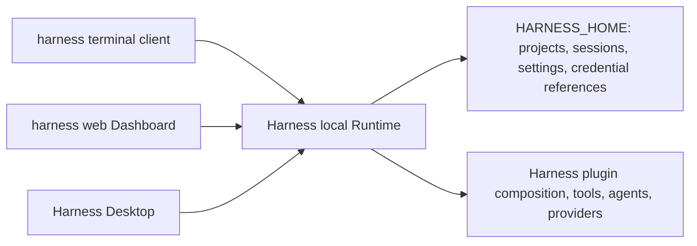

# Harness unified local Runtime design

English | [中文](2026-08-18-harness-unified-local-runtime-design.zh.md)

## Status and scope

This design defines the Runtime, persistence, public-entry, and desktop-integration architecture for Harness Desktop 1.1.0. It is the authoritative design for `harness`, `harness web`, and `harness desktop` on one computer.

It refines the runtime ownership and client topology in the [Harness Desktop product architecture design](2026-08-15-harness-desktop-design.md). The earlier design continues to describe the application foundation and release constraints where this document does not replace them.

The durable topology rationale is recorded in the [Harness Desktop product topology Agent Note](../../../.agents/notes/proposed/architecture/2026-08-15-harness-desktop-product-topology.md).

## Product promise

- `harness` is an interactive terminal coding agent, not a shortcut to a browser.
- `harness web` is an independently usable browser Dashboard.
- `harness desktop` is an independently usable native desktop application.
- The three clients on one computer show the same projects, sessions, model settings, and credential references through one local Runtime.
- No client reads or writes Harness persistence directly; the Runtime serializes durable operations and protects the local data directory.

## Out of scope

- Harness 1.1.0 does not synchronize projects, sessions, settings, or credentials between computers.
- The Runtime never listens on a LAN address and is not a remotely managed service.
- Project records reference user-owned folders; Harness never copies an entire workspace into its data directory.
- The desktop application does not create a separate conversation engine, persistence database, or credential store.
- The product does not copy DeepSeek characters, logos, names, source art, or other identifiable visual assets.

## Local Runtime

### Process topology



One Runtime instance owns one `HARNESS_HOME`. It assembles the existing Harness Web composition, API gateway, session services, settings services, and credential-reference services. It provides the authenticated local API that every client uses and remains the only process allowed to mutate durable Harness state.

The first client that needs the Runtime starts it; a client that finds a healthy instance attaches to it. Startup uses an atomic per-home instance lock. The lock records a process identifier and platform-specific process-start identity so PID reuse cannot be mistaken for a live owner. An abandoned lock or endpoint record is removed only after the recorded process identity is proved dead.

The Runtime binds an OS-selected random port on `127.0.0.1` only. Its endpoint record contains the protocol version, port, process identity, and an opaque local access token. The record is atomically replaced and is readable only by the current OS user. The token never appears in a command line, browser URL, transcript, diagnostic bundle, or persisted browser storage. Only a CLI launcher or the Electron main process uses the token for private loopback control operations; Dashboard JavaScript and the Electron renderer never receive it.

### Local Dashboard authentication

An authenticated launcher or Electron main process mints a one-time browser handoff secret for a specific Runtime endpoint. The handoff expires after 60 seconds and is retained only in Runtime memory until its first successful exchange. Browser navigation carries it only in a URL fragment such as `/#handoff=<secret>`, which is not sent in an HTTP request or referrer. Before rendering protected state, the Dashboard bootstrap exchanges the fragment on the exact loopback origin, clears it with `history.replaceState`, and receives a session cookie marked `HttpOnly; SameSite=Strict; Path=/`.

Runtime API endpoints and event streams accept the Dashboard only with that session cookie and the exact `http://127.0.0.1:<port>` origin; they reject cross-origin credential requests. Handoff secrets and session identifiers never enter localStorage, sessionStorage, IndexedDB, diagnostics, or transcripts. Runtime shutdown invalidates every handoff and session. Electron main mints a replacement handoff before it reloads a recovered Dashboard; an ordinary browser tab instead shows a copyable `harness web` reconnection command.

### Connection, ordering, and lifetime

Clients use the existing API and event-stream mechanisms through a Runtime connection layer. Reads may proceed concurrently. The Runtime serializes every write to a session, project catalog, settings document, or credential-reference document, and it emits invalidations so attached clients converge without polling.

Only one agent operation may actively write a given session. A second client receives a typed busy response that identifies the active session and offers to observe it, open a new session, or wait to resume it. This prevents split-brain transcripts without making one client a special owner.

The Runtime stays alive while it has an attached client, active agent work, or an explicit background lease. `--daemon` and `--background` create the same in-process background lease. `harness web --status` authenticates to an existing Runtime without starting one and reports its redacted health and lease state; `harness web --stop` releases the background lease without cancelling agent work or disconnecting other clients. Only when no client, active work, or background lease remains does the Runtime begin its configurable idle period, flush state, remove its endpoint record, release its lock, and exit.

A background lease never causes automatic restart after a Runtime crash, user sign-out, or application upgrade. Stale records are still cleaned only after process-identity verification. Closing one browser tab, terminal, or desktop window never stops work still used by another client.

## Data root and migration

`HARNESS_HOME` is the only writable Harness data root. When the environment variable is absent, the default is `%LOCALAPPDATA%\Harness Desktop` on Windows, `~/Library/Application Support/Harness Desktop` on macOS, and `$XDG_DATA_HOME/harness-desktop` or `~/.local/share/harness-desktop` on Linux.

The data root contains only Harness-owned metadata, durable sessions, settings documents, credential references, Runtime locks, and endpoint records. Secret values stay in the platform credential provider or an explicit environment-backed provider; they are not copied into the data root as plaintext.

On first start, a detected legacy `DSH_HOME` is offered as an import source. Import copies supported data into an empty target, records the result, preserves the legacy directory, and stops on a destination collision. It never silently overwrites or deletes data. A failed import leaves both roots inspectable and reports the exact next action.

## Public entry points

### `harness`

Running `harness` with no task starts an interactive terminal agent for the current directory. It starts or attaches to the local Runtime, opens or resumes a session associated with that workspace, and renders streaming model output, tool activity, approvals, and diagnostics in the terminal. It does not require `--profile`.

`harness "task"` starts the same terminal experience with an initial task. `harness run "task"` is the script-oriented form, and `harness run "task" --json` writes JSONL protocol events to stdout while leaving diagnostics on stderr. The terminal client can list and resume shared sessions, change shared model and permission settings through the Runtime, and exit without stopping other clients.

### `harness web`

`harness web` starts or attaches to the Runtime, mints a one-time browser handoff, opens the Dashboard in the default browser, and subscribes to the same project and session state as the terminal client. `--daemon` and `--background` are supported aliases that create the background lease after the launcher returns. `harness web --status` never starts a Runtime; `harness web --stop` only releases its background lease. `--no-open` prevents browser navigation and creates no background lease unless it is combined with `--daemon` or `--background`.

The Dashboard is the real existing Harness Web application, not a second mock chat UI. It exposes workspace selection, session history, conversation, streaming tools, approvals, models, credentials, and settings through the Runtime API.

### `harness desktop`

`harness desktop` starts or activates the installed Harness Desktop application. The desktop application starts or attaches to the same Runtime and renders the same Dashboard state. If the desktop application is not installed, the command prints the platform-specific installation route and exits without creating a hidden substitute process.

Electron owns native operations such as folder selection, notifications, external-link opening, and recovery diagnostics. Its main process retains the Runtime token, mints the Dashboard handoff, and loads the real Dashboard through a narrow preload bridge. The renderer has context isolation, sandboxing, disabled Node integration, and a strict CSP; it cannot read the data root, credential provider, child-process handles, or Runtime token.

### Compatibility and source launches

The installed CLI package remains `@harness-desktop/cli` and installs globally with `npm install -g @harness-desktop/cli`. Its primary executable is `harness`. The `dsh` executable stays as a compatibility alias that uses the same parser, Runtime, data root, and command graph.

Source launches use `pnpm harness`, `pnpm harness web`, and `pnpm harness desktop` with the same public arguments. `dsh web --daemon` and `dsh web --background` remain valid aliases during the compatibility period.

```text
harness
harness "fix the failing tests"
harness run "task" --json
harness web --daemon
harness web --background --no-open
harness web --status
harness web --stop
harness desktop
```

## Desktop and Dashboard

The desktop window contains the real Dashboard rather than a standalone welcome screen. It must let a user select a workspace, create and recover sessions, converse with the agent, inspect streaming tool calls, answer approvals, and edit model, credential, and application settings. Changes made through any client appear in the other attached clients through the Runtime event stream.

Desktop startup shows a clear local recovery page only while the Dashboard or Runtime is unavailable. The page provides retry, a copyable redacted diagnostic summary, and an installation or update action where applicable. It must never present an empty product shell as if the agent were ready.

## Product icon assets

Harness Desktop uses the approved original B direction, "star-trail little whale": a round blue-violet whale companion with soft pink highlights, a small star trail, and a friendly local-agent character. The icon is inspired by the requested friendly whale mood, not by a DeepSeek character or other protected artwork.

The asset source is an editable SVG with documented color tokens. The release pipeline derives a Windows multi-size `.ico`, macOS `.icns`, Linux PNG variants, Web favicon and PWA icons, and light and dark variants. At 64 pixels and above the star trail is retained; at 32 and 16 pixels the mark reduces to a legible whale silhouette and one star.

## Packaging, release, and documentation

The 1.1.0 release produces Windows NSIS, macOS universal DMG, Linux AppImage and Deb, and the global npm CLI. Platform installer smoke tests start the desktop app, attach it to a local Runtime, and verify the Dashboard rather than only the Electron process.

The English and Chinese root README documents global CLI installation, all three commands, the shared local data root, legacy `DSH_HOME` import, background Web operation, desktop download, installation, uninstallation, and the difference between the three independently usable clients. A code push does not by itself publish npm or create a GitHub Release; each external publication needs explicit approval.

## Delivery workstreams

1. Create the Runtime discovery, locking, local authentication, data-root resolution, and legacy import foundation with focused lifecycle tests.
2. Replace the profile-required default CLI path with the terminal client, script mode, shared-session commands, and source/built entry tests.
3. Make the Web command attach to the Runtime, preserve `--daemon` and `--background`, and verify live cross-client state delivery.
4. Replace the desktop welcome shell with the secured Dashboard host and verify desktop startup, recovery, and Runtime attachment on clean output trees.
5. Add the original icon source and derived platform assets, package metadata, release smoke checks, bilingual README guidance, and cross-client acceptance tests.

Each workstream is separately reviewable and leaves a runnable source tree. No workstream may introduce a second persistence writer, a different credential store, or a client-private session format.

## Failure behavior and verification

The Runtime reports typed, redacted failures for lock contention, stale records, version mismatch, unavailable credentials, failed legacy import, malformed local requests, and child or plugin startup failures. A client reports the failed subject, correction, and a copyable diagnostic identifier without exposing access tokens or secret values.

Focused tests cover data-root selection, import collision handling, lock recovery, loopback-only binding, token non-disclosure, handoff expiry and single use, cookie-only Dashboard authentication, Runtime idle behavior, background-lease status and stop behavior, CLI input and JSON output, Web daemon aliases, desktop privilege isolation, Dashboard availability, and icon-asset packaging. Cross-client integration tests create a project and session from each frontend, observe the same durable state from the other two, reject concurrent session operations, and prove safe recovery after an unexpected client exit.

Acceptance for 1.1.0 requires a clean Windows, macOS, and Linux path where a user installs the CLI and desktop application, runs all three commands independently, selects the same local workspace, exchanges work through one session history, and can close either client without losing the others' active work.
