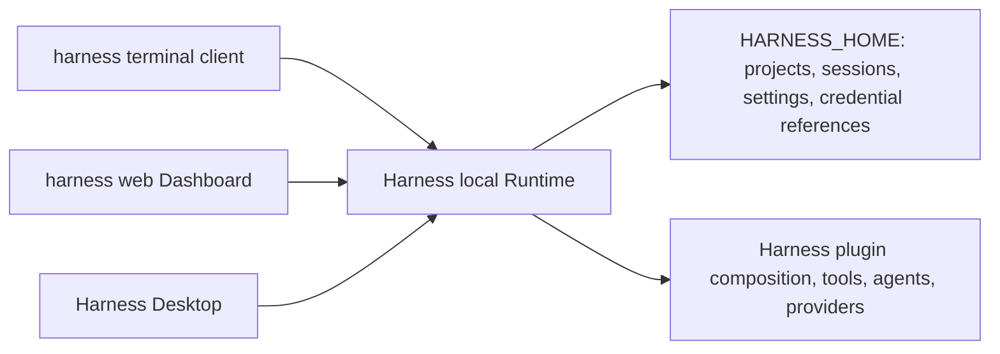

# Harness 统一本地 Runtime 设计

[English](2026-08-18-harness-unified-local-runtime-design.md) | 中文

## 状态与范围

本文定义 Harness Desktop 1.1.0 的 Runtime、持久化、公开入口和桌面集成架构。它是同一台电脑上 `harness`、`harness web` 与 `harness desktop` 的权威设计。

本文细化 [Harness Desktop 产品架构设计](2026-08-15-harness-desktop-design.md) 中的 Runtime 所有权和客户端拓扑。此前设计在本文未取代的范围内继续定义应用基础和发布约束。

长期有效的拓扑理由记录在 [Harness Desktop 产品拓扑 Agent Note](../../../.agents/notes/proposed/architecture/2026-08-15-harness-desktop-product-topology.md) 中。

## 产品承诺

- `harness` 是交互式终端 coding agent（编程智能体），不是浏览器快捷方式。
- `harness web` 是可独立使用的浏览器 Dashboard（仪表盘）。
- `harness desktop` 是可独立使用的原生桌面应用。
- 同一台电脑上的三个客户端通过一个本地 Runtime 显示相同的项目、会话、模型设置和凭据引用。
- 没有客户端直接读取或写入 Harness 持久化；Runtime 串行化耐久操作并保护本地数据目录。

## 非目标

- Harness 1.1.0 不在电脑之间同步项目、会话、设置或凭据。
- Runtime 绝不监听局域网地址，也不是远程托管服务。
- 项目记录只引用用户拥有的文件夹；Harness 绝不把整个工作区复制到数据目录。
- 桌面应用不创建独立的对话引擎、持久化数据库或凭据存储。
- 产品不复制 DeepSeek 角色、标志、名称、源图或其他可识别的视觉资产。

## 本地 Runtime

### 进程拓扑



一个 Runtime 实例拥有一个 `HARNESS_HOME`。它组合现有 Harness Web 配置、API 网关、会话服务、设置服务和凭据引用服务。它提供每个客户端使用的已认证本地 API，并且始终是唯一允许修改 Harness 耐久状态的进程。

第一个需要 Runtime 的客户端启动它；发现健康实例的客户端连接到它。启动使用每个数据根目录的原子实例锁。锁记录进程标识符和平台特定的进程启动身份，因此不会把 PID 复用误认为仍存活的所有者。只有证明记录的进程身份已死亡时，才会移除废弃的锁或端点记录。

Runtime 只在 `127.0.0.1` 上绑定由操作系统选择的随机端口。其端点记录包含协议版本、端口、进程身份和不透明的本地访问令牌。记录以原子方式替换，并且仅当前操作系统用户可读。令牌绝不出现在命令行、浏览器 URL、会话记录、诊断包或持久化浏览器存储中。只有 CLI 启动器或 Electron 主进程会使用令牌执行私有 loopback 控制操作；Dashboard JavaScript 和 Electron Renderer 绝不接收它。

### 本地 Dashboard 认证

已经认证的启动器或 Electron 主进程会为指定 Runtime 端点签发高熵、不透明、一次性的浏览器 handoff 密钥。handoff 在 60 秒内过期，并且仅在第一次成功交换之前保留在 Runtime 内存中。启动器会创建只允许当前用户访问的一次性本地 bootstrap 目录和文档，验证仅所有者 POSIX mode 或当前用户 Windows ACL，拒绝权限更宽的位置，并打开 file URL 干净、HTML body 含隐藏 handoff 字段的文档。本地 file 具有不透明 origin，因此其顶级表单向 `http://127.0.0.1:<port>/_harness/handoff` 发出的 `POST` 有意跨 origin：handler 不要求 Origin 相等、不发送 CORS permission，只用表单正文中的密钥认证、以原子方式只消费一次，并以干净的 `303` 导航到 Dashboard。启动器拥有的清理 helper 只接收 bootstrap 文档路径，在 `expiresAt` 安排精确一次 cleanup，在 dispatch failure、exchange success 或 failure，或 expiry 后删除文档及所属目录，绝不把 handoff 放入参数、日志、URL、历史记录、referrer、header、浏览器存储、诊断、会话记录、浏览器脚本存储或 Renderer IPC。

Runtime 只通过 `Set-Cookie` 签发交换后的随机或签名会话凭据，浏览器只在 `Cookie` 请求头中发送它，并且只保留在其 HttpOnly cookie jar 中。该会话 cookie 使用 `HttpOnly; SameSite=Strict; Path=/`、不带 expiry attribute，绝不暴露给 Dashboard JavaScript、Renderer IPC、localStorage、sessionStorage、IndexedDB、应用持久化、诊断、快照或会话记录。Runtime API 端点和事件流只接受带该会话 cookie 且来自精确 `http://127.0.0.1:<port>` origin 的 Dashboard；它们拒绝跨 origin 的凭据请求。Runtime 关闭会使每个 handoff 和会话失效。Electron 主进程在重新加载恢复后的 Dashboard 前签发新的 handoff；普通浏览器标签页则显示可复制的 `harness web` 重连命令。

### 连接、顺序与生命周期

客户端通过 Runtime 连接层使用现有 API 和事件流机制。读取可并发进行。Runtime 串行化对会话、项目目录、设置文档或凭据引用文档的每一次写入，并发出失效通知，使已连接客户端无需轮询即可收敛。

同一会话一次只能有一个 agent 操作处于活动写入状态。第二个客户端会收到类型化的忙碌响应，其中标识活动会话，并提供观察它、创建新会话或等待恢复的选项。这样可防止分裂会话记录，而不会让某个客户端成为特殊所有者。

当存在已连接客户端、活动 agent 工作或显式后台租约时，Runtime 保持存活。`--daemon` 和 `--background` 创建同一种进程内后台租约。`harness web --status` 只认证并连接已存在的 Runtime，不会启动新实例；它报告脱敏后的健康和租约状态。`harness web --stop` 只释放后台租约，不会取消 agent 工作或断开其他客户端。只有当没有客户端、活动工作和后台租约时，Runtime 才开始可配置的空闲期、刷写状态、移除端点记录、释放锁并退出。

后台租约绝不会在 Runtime 崩溃、用户退出登录或应用升级后触发自动重启。废弃记录仍然只有在完成进程身份验证后才会清理。关闭一个浏览器标签、终端或桌面窗口，绝不会停止仍被另一个客户端使用的工作。

## 数据根目录与迁移

`HARNESS_HOME` 是唯一可写的 Harness 数据根目录。环境变量不存在时，默认值在 Windows 上为 `%LOCALAPPDATA%\Harness Desktop`，在 macOS 上为 `~/Library/Application Support/Harness Desktop`，在 Linux 上为 `$XDG_DATA_HOME/harness-desktop` 或 `~/.local/share/harness-desktop`。

数据根目录只包含 Harness 拥有的元数据、耐久会话、设置文档、凭据引用、Runtime 锁和端点记录。密钥值留在平台凭据提供方或显式的环境变量提供方中；它们不会以明文复制到数据根目录。

首次启动时，检测到的旧 `DSH_HOME` 会作为导入源提供。导入将受支持数据复制到空目标、记录结果、保留旧目录，并在目标冲突时停止。它绝不静默覆盖或删除数据。导入失败会让两个根目录都保持可检查状态，并报告明确的下一步操作。

## 对外入口

### `harness`

无任务运行 `harness` 会为当前目录启动交互式终端 agent。它启动或连接本地 Runtime，打开或恢复与该工作区关联的会话，并在终端中渲染流式模型输出、工具活动、审批和诊断。它不需要 `--profile`。

`harness "task"` 会以初始任务启动相同的终端体验。`harness run "task"` 是脚本导向形式，`harness run "task" --json` 将 JSONL 协议事件写入 stdout，同时将诊断保留在 stderr。终端客户端可以列出并恢复共享会话，通过 Runtime 修改共享模型和权限设置，并在退出时不停止其他客户端。

### `harness web`

`harness web` 启动或连接 Runtime，签发一次性浏览器 handoff，在默认浏览器中打开 Dashboard，并订阅与终端客户端相同的项目和会话状态。`--daemon` 与 `--background` 是受支持的别名；它们会在启动器返回后创建后台租约。`harness web --status` 绝不启动 Runtime；`harness web --stop` 只释放其后台租约。`--no-open` 禁止浏览器导航；除非与 `--daemon` 或 `--background` 组合，否则它不会创建后台租约。

Dashboard 是真实的现有 Harness Web 应用，而不是第二个模拟聊天 UI。它通过 Runtime API 提供工作区选择、会话历史、对话、流式工具、审批、模型、凭据和设置。

### `harness desktop`

`harness desktop` 启动或激活已安装的 Harness Desktop 应用。桌面应用启动或连接同一个 Runtime，并渲染相同的 Dashboard 状态。如果没有安装桌面应用，该命令会输出按平台区分的安装路径并退出，不会创建隐藏的替代进程。

Electron 拥有文件夹选择、通知、外部链接打开和恢复诊断等原生操作。它的主进程保留 Runtime 令牌、签发 Dashboard handoff，并通过狭窄的 preload bridge 加载真实 Dashboard。Renderer 具有 context isolation、沙箱、关闭的 Node integration 和严格 CSP；它无法读取数据根目录、凭据提供方、子进程句柄或 Runtime 令牌。

### 兼容性与源码启动

安装版 CLI 包保持为 `@harness-desktop/cli`，并通过 `npm install -g @harness-desktop/cli` 全局安装。它的主可执行文件是 `harness`。`dsh` 可执行文件保留为兼容别名，并使用相同的解析器、Runtime、数据根目录和命令图。

源码启动使用 `pnpm harness`、`pnpm harness web` 和 `pnpm harness desktop`，并接受相同的公开参数。在兼容期内，`dsh web --daemon` 和 `dsh web --background` 仍然有效。

```text
harness
harness "fix the failing tests"
harness run "task" --json
harness web --daemon
harness web --background --no-open
harness web --status
harness web --stop
harness desktop
```

## Desktop 与 Dashboard

桌面窗口包含真实 Dashboard，而不是独立欢迎页。它必须让用户选择工作区、新建和恢复会话、与 agent 对话、检查流式工具调用、回答审批，并编辑模型、凭据和应用设置。通过任一客户端作出的更改都会通过 Runtime 事件流出现在其他已连接客户端中。

只有 Dashboard 或 Runtime 不可用时，桌面启动才显示明确的本地恢复页。该页提供重试、可复制的脱敏诊断摘要，以及适用时的安装或更新操作。它绝不能把空产品壳显示为 agent 已准备好。

## 产品图标资产

Harness Desktop 使用已确认的原创 B 方向“星轨小鲸”：圆润的蓝紫色鲸鱼伙伴、柔和粉色高光、小星轨和友好的本地 agent 形象。图标借鉴所请求的友好鲸鱼气质，而不是 DeepSeek 角色或其他受保护作品。

资产源是带有已记录颜色令牌的可编辑 SVG。发布流水线派生 Windows 多尺寸 `.ico`、macOS `.icns`、Linux PNG 变体、Web favicon 和 PWA 图标，以及深浅色变体。在 64 像素及以上保留星轨；在 32 和 16 像素时，图标简化为清晰鲸形轮廓和一颗星。

## 打包、发布与文档

1.1.0 发布产出 Windows NSIS、macOS 通用 DMG、Linux AppImage 和 Deb，以及全局 npm CLI。平台安装器 smoke test（冒烟测试）启动桌面应用、将其连接到本地 Runtime，并验证 Dashboard，而非只验证 Electron 进程。

英文和中文根 README 记录全局 CLI 安装、全部三个命令、共享本地数据根目录、旧 `DSH_HOME` 导入、后台 Web 操作、桌面下载、安装、卸载以及三个可独立使用客户端之间的差异。代码推送本身不会发布 npm 或创建 GitHub Release；每次外部发布都需要明确批准。

## 交付工作流

1. 创建 Runtime 发现、锁定、本地认证、数据根目录解析和旧数据导入基础，并配备聚焦的生命周期测试。
2. 将需要 profile 的默认 CLI 路径替换为终端客户端、脚本模式、共享会话命令和源码/构建入口测试。
3. 让 Web 命令连接 Runtime、保留 `--daemon` 和 `--background`，并验证实时跨客户端状态传递。
4. 用受保护的 Dashboard 宿主替换桌面欢迎壳，并在干净输出树上验证桌面启动、恢复和 Runtime 连接。
5. 添加原创图标源和派生平台资产、包元数据、发布 smoke check、双语 README 指引和跨客户端验收测试。

每个工作流都可独立评审，并保留可运行的源码树。任何工作流都不得引入第二个持久化写入者、不同的凭据存储或客户端私有会话格式。

## 失败行为与验证

Runtime 为锁冲突、陈旧记录、版本不匹配、不可用凭据、旧数据导入失败、格式错误的本地请求以及子进程或插件启动失败报告类型化、脱敏的失败。客户端报告失败对象、修正方法和可复制的诊断标识符，而不暴露访问令牌或密钥值。

聚焦测试覆盖数据根目录选择、导入冲突处理、锁恢复、仅回环绑定、令牌不泄露、仅所有者 bootstrap mode 或 ACL 并拒绝权限更宽的位置、在 `expiresAt` 的精确一次 cleanup timer（包括 never-dispatched 文档以及 dispatch/exchange failure）、来自不透明 file origin 的仅正文 handoff 交换且拒绝错误、复用和过期 handoff、无 CORS permission 与干净 `303`、仅 cookie 且精确 origin 的 Dashboard 认证、Runtime 空闲行为、后台租约的状态与停止行为、CLI 输入和 JSON 输出、Web daemon 别名、桌面权限隔离、Dashboard 可用性和图标资产打包。跨客户端集成测试从每个前端创建项目和会话，在另两个前端观察相同耐久状态、拒绝并发会话操作，并证明意外客户端退出后的安全恢复。

1.1.0 的验收要求为 Windows、macOS 和 Linux 上的干净路径：用户安装 CLI 和桌面应用、独立运行全部三个命令、选择同一个本地工作区、通过一份会话历史交换工作，并且可以关闭任一客户端而不丢失其他客户端的活动工作。
